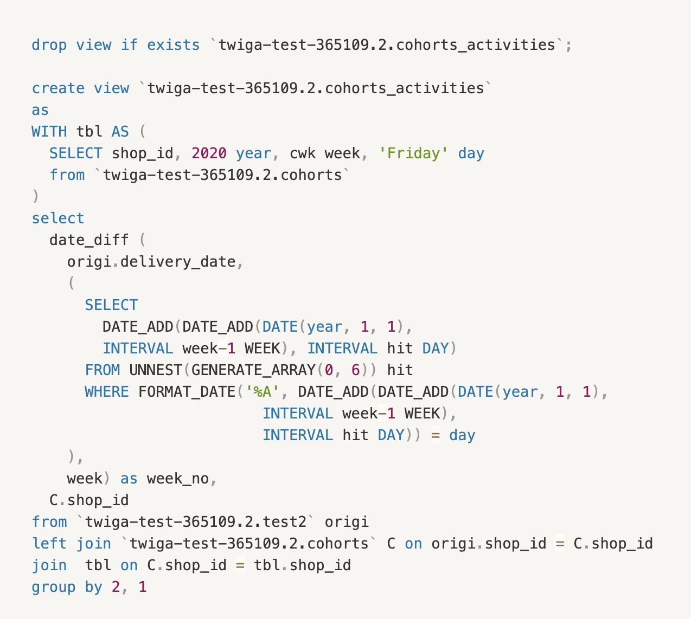

## Data Engineer Exercises
<!-- ##### Submitted By: [David K. Njuguna](https://github.com/dakn2005) -->

---
### Google Cloud's BigQuery 
---
> Tool: Google Cloud's BigQuery
>
> Viz Tool: Data Studio

 

#### **Exectuive Summary**

_The Company_ uses BigQuery  as a data warehouse to store analytical data.
    An extract from the deliveries table containing below schema is attached."
delivery_date - date(UTC)
shop_id - UUID
revenue - float

As the Data Engineer at _The Company_, you are asked by the Strategy Lead to design reports on Data Studio and Power BI;

Required:
1. Write an SQL Query Using BiqQuery syntax to render Weekly Corhort Retention.
2. Write an SQL Query Using BiqQuery syntax to render Week on Week Retention.
3. Write an SQL Query Using BiqQuery syntax to render Corhort Revenue Retention.
4. Describe how you will visualize the data on Power Bi and Data Studio outlining the connectors and suitable charts to be used.

#### **Introduction**
The first step is creating the database schema in BigQuery and uploading the exercise data. For this, we can use the free BigQuery sandbox.

#### **Preparation**
The next steps are creating views for obtaining cohort retention rates.
We start by extracting weekly cohorts from the dataset, using the provided date column - _delivery_date_

The cohort is created based on the week a shop first reported revenue 

The next step is obtaining cohort sizes

After this obtain weekly activity per shop. This checks how a shop reported its revenue on a weekly basis. As extracted from the delivery_date field, with the year for this dataset bound to 2020 and having friday as the bounding last day in the week.

then creating a cohorts retention table, with counts of reported shops per subsequent week

With these, we can answer the questions below

#### **Questions**

1. Write an SQL Query Using BiqQuery syntax to render Weekly Corhort Retention.

2. Write an SQL Query Using BiqQuery syntax to render Week on Week Retention.

3. Write an SQL Query Using BiqQuery syntax to render Corhort Revenue Retention.

4. Describe how you will visualize the data on Power Bi and Data Studio outlining the connectors and suitable charts to be used.

    ---

    **_Power BI_**

    From Power BI desktop, go to the _Get Data_ tab. Under that choose the Google BigQuery connector, which prompts for credentials. Once connected, the Navigator tool opens displaying your schema on BigQuery - select all required tables and views as presented.

    After adding the required views (as specified above), use _Clustered column chart_ for the weekly retention, _line chart_ for the week-on-week, _line chart_ for the cohort revenue retention chart

    ---
    **_Data Studio_**

    Using the online console, after running a query and results are obtained, click on "Explore Data" - this opens in a new browser tab, with resulting query columns presented. 

    The charts shown below are generated using Google Data Studio
   
    **Charts - Google Data Studio** 

    For weekly cohort, a grouped bar chart is appropriate. The x-axis represents weeks, while y-axis is the retention rate

    

    For week-on-week, a line chart is appropriate

    

    Cohort revenue retention
    

----
### Data Visualizations
----
> BI Tool: Tableau
>
> Charts Link: https://public.tableau.com/app/profile/david3779/viz/WineCountry/WineStoryboard

 

#### **Executive Summary**
Use the dataset_1.1. You are free to manipulate and visualize the data using either, Data Studio, PowerBi, excel or any other 	
data visualization tool of your choice, that is either shareable in a web link or a file. Please answer the questions below and create any charts, or other materials 	
you’d like to help walk us through your answers. 	
	
Dataset	
The dataset includes statistics for 10,000 top wines recently reviewed by Wine Enthusiast. A description of each field can be found below. 	
Only wines with a score of 80-100 are included, and higher numbers are considered better.	
	
Required:
1. Provide a ranking of countries by the quality of the wine they produce, and explain why you ranked countries in the way you did.	
	
2. How would you describe the relationship between the price of a wine and the score it receives?	

3. Do you find any evidence of bias in the way certain tasters assess wines, or in the scores that wines from certain countries or provinces receive?	
	
4. Which countries produce the greatest variety of wine?	

5. Do different countries tend to have different distributions of wine scores (e.g. wines clustered at the low, middle, or high end of the 80-100 scale)?	

#### **Introduction**
Started by loading the dataset into tableau using the default excel connector. 

After performing data exploration and visualization, I built a storyboard on tableau using selected sheets ([link shared above](https://public.tableau.com/app/profile/david3779/viz/WineCountry/WineStoryboard)). Individual charts are represented as pages in the storyboard

#### **Questions**
1. Provide a ranking of countries by the quality of the wine they produce, and explain why you ranked countries in the way you did.
    > Storyboard Page: Average Score Ranking per Country

        Taking into consideration that the scores are bound between 80-100 (therefore no outliers), I decided to use an average score. Otherwise would have considered other measures of central tendencies like median

2. How would you describe the relationship between the price of a wine and the score it receives?
    > Storyboard Page: Price v Score Correlation

        The relationship is positively correlated; as the score of wines increases, the price increases

3. Do you find any evidence of bias in the way certain tasters assess wines, or in the scores that wines from certain countries or provinces receive?
   > Storyboard Page: Tasters Bias Check

        From the obtained visual, and checking against an average trend line per country, province and sommelier, there is little to no evidence of bias. Further statistical testing can be performed when a general mean is obtained for the selected features, comparing with calculated means.

4. Which countries produce the greatest variety of wine?
    > Storyboard Page: Variety per Country - Distinct count of variety feature
   
        These charts were produced with the assumption that different variety of grapes produce different variety of wines

5. Do different countries tend to have different distributions of wine scores (e.g. wines clustered at the low, middle, or high end of the 80-100 scale)?
    > Storyboard Page: Wine Scores Distrn

        Yes; as shown using the box and whisker plot; Observing for quartiles and median plots
